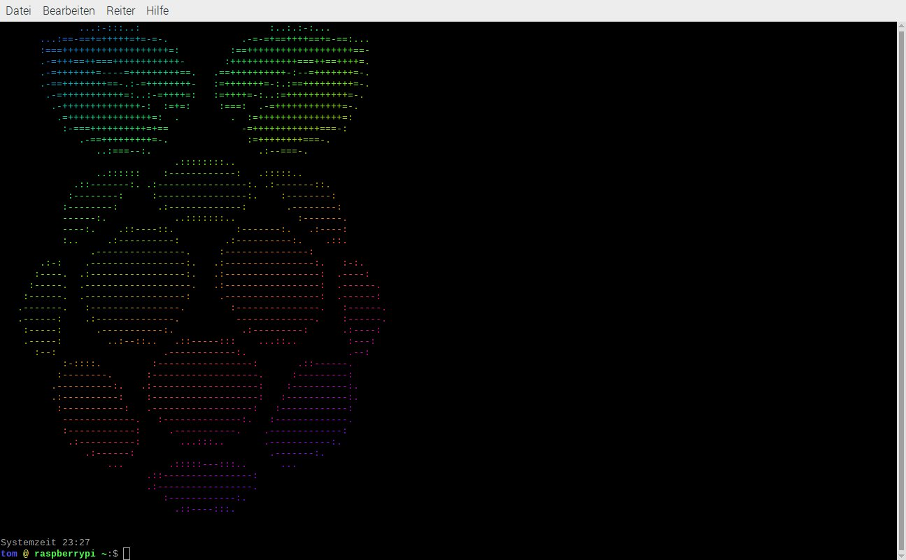
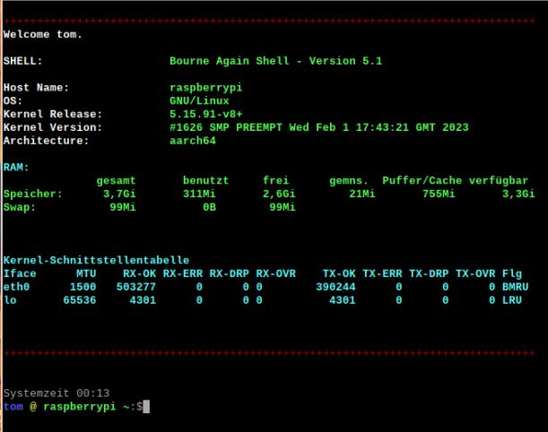

# The .bashrc-file

--------------------------------------------------------------------------------------------------------------------------
First issue of my [.bashrc](/.bashrc) with its associates files. It produces a simple but nice output and is suitable for the average user. If you want more functionality while using e.g. GitHub then you should look for other repos like [Voku/dotfiles](../../../../../voku/dotfiles).

Suggestions are always welcome.

## Instructions

1. **Backup your current ~/.bashrc** e.g. with `mv -iv .bashrc bashrc.old` or `cp -i .bashrc bashrc.old`.
2. Download the repo as zip-file and extract the content into your home folder. Overwrite existing files. (**Do not forget to backup your current files.** Just saying!)
3. Start an interactive shell (means: open a terminal).

You will only need the follwing files:

+ [~/.bashrc](/.bashrc) (necessary)
+ [~/.logo](/.logo) (optional)
+ [~/.shellcfg/alias](/.shellcfg/alias) (necessary for full functionality)
+ [~/.shellcfg/colors](/.shellcfg/colors) (optional, necessary for color prompt)
+ [~/.shellcfg/functions](/.shellcfg/functions) (necessary for full functionality)
+ [~/.shellcfg/what_shell](/.shellcfg/what_shell) (see also [what-the-(s)hell section](/README.md#what-the-(s)hell) below)

If any of these files are missing, the shell will still work. However, under certain circumstances no [aliases](/.shellcfg/alias) or [functions](/.shellcfg/functions) will then be declared. If [/.shellcfg/colors](/.shellcfg/colors) is missing, the prompt won't look very nice, and that's putting it euphemistically.

Other things that come with the zip file may also be important, but not required. For example the README.md you are reading right now. 
If something goes wrong, it's no drama. Just rename your backup files to their original names and you'll be fine.
 You have backup files, right?

## Automated Backup

With this [.bashrc](/.bashrc) every time you start a terminal it will check if there is a directory named backup in `~/.shellcfg/`. If not, it will create one and backup the files I mentioned above. Just these files. If you cannot see the original files and the shellcfg-directory in your favorite file manager, you need to enable "Show hidden files". The backup files are not hidden and named `<FILENAME>.backup` resp. `<FILENAME>.backup~` (You'll have two versions of the backup). You can navigate to the ~/.shellcfg/ directory with `cd ~/.shellcfg/` and display the contents with the `ls` command.

If you messed up and want to roll back, you need to copy the backup files from `~/.shellcfg/backup/`to `~/` and rename them to `.<FILENAME>` respectively `~/.shellcfg/<FILENAME>`. Backups are only created when files have been modified. Maybe one day I'll implement a handy rollback feature, but for now you should have a basic knowledge of file management, e.g. how to the copy, move or rename files. For more information use `man cp` or `man mv` at the command line.

## Content

This [.bashrc](/.bashrc) consists of several files. On the one hand the actual [.bashrc](/.bashrc) and on the other hand a few files that are assigned to certain settings (mentioned above).
In principle, the contents of these files could also be written directly to the [.bashrc](/.bashrc), but it is a bit cleaner this way.
 These files can be found in the `~/.shellcfg/` directory.

## Aliases and functions

There are a few functions and aliases as well as color definitions in the corresponding files. To take full advantage, be sure to check out these files.

+ [~/.shellcfg/alias](/.shellcfg/alias)
+ [~/.shellcfg/colors](/.shellcfg/colors)
+ [~/.shellcfg/functions](/.shellcfg/functions)

However, be aware that things can get messed up very quickly if the files are modified in the wrong way (see section [Automated Backup](/README.md#automated-backup)).

### Aliases in [~/.shellcfg/alias](/.shellcfg/alias)

Way to much to mention all here. Most of them are explained in the file, but currently mostly in German. (see [todo list](/todo.md))

### Functions in [~/.shellcfg/functions](/.shellcfg/functions)

|Name|Usage|Description|
|-|-|-|
| **allcolors** | allcolors | It will show you almost all color codes that can be used when prettifying your prompt.   Before you fiddle around with color codes just have a look at the file [~/shellcfg/.colors](/shellcfg/.colors). There is a chance your desired color has already a human readable equivalent.|
| **wtfis** | wtfis&nbsp;&lt;arg&gt; | Like `which` but exposes much more info.  &lt;arg&gt; has to be the name of a program that is installed on your system, e.g. `wtfis man`.   ❗**Be patient!** This function needs some time to parse all the information.❗|

## what the (s)hell

The idea behind it was to make the whole thing accessible to other shells as well and to prevent, if possible, that - apart from renaming the [.bashrc](/.bashrc) file - any user-side changes to the files are necessary for it to work. For now, the query should work in the following environments: Bourne Shell (sh),  Bourne-Again Shell (bash), Korn-Shell (ksh) and maybe Z-Shell (zsh). The Debian-Almqist-Shell (dash) is also recognized, although using dash as an interactive shell is not recommended, since there are always shell scripts that are not fully POSIX-compatible and only work if Bash is used instead of dash.

However, there is another tiny problem: 
Different shells have different filenames. For example, the equivalent of a [.bashrc](/.bashrc) file is .zshrc in the Z-Shell and .kshrc in the Korn-Shell, to name just two other common shells. Also, the commands may vary depending on which shell is used and whether that is also the default shell or possibly called from another shell. This may require different queries. Therefore, the file [~/.shellcfg/what_shell](/.shellcfg/what_shell) is currently only safe to use in Bash and should not cause any problems here, but may work within Korn-Shell as well, perhaps even within the Z-Shell . If errors occur, I would be grateful for information on this and will take them into account accordingly. Of course, this applies to the entire repo.

But now to the point: 
In principle, a - more or less simple - query is sufficient to find out the name of the shell. As usual in Linux, there is more than one way to achieve a goal. To check which shell is being used, the following commands can be used:

+ `$SHELL` - the easiest way and the most commonly used, and displays the default shell for the system (or user), which is usually (but not necessarily) the shell actually being used at any given time
+ `ps -cp "$$" -o command=""` - shows the actual shell currently in use, but that wouldn't always work everywhere, e.g. in Tenex-C-Shell (tcsh) it will not

But the standard output for `$SHELL` is ugly: _/bin/bash_. `ps -cp "$$" -o command=""` isn't much better either: _bash_ Yes it's functional and yes it's ugly. Because of this, I wrote a few lines to send the output to a variable and change the displayed information accordingly. That's why the terminal says "BASH" and not "/bin/bash", although the query is made using the "$SHELL" command.

Furthermore the version query does only work in BASH this way. In order to be able to use this "feature" in other shells as well, the corresponding query would have to be adapted depending on the shell used. However, this should then also be done without the user having to do anything. (This has not yet been implemented.)

But to be honest, I have my slightest doubts as to whether this goal can ever be achieved. For now, I don't recommend using these files without customizations in shells other than BASH. If possible I will try to make it suitable for other shells. In this case the file [~/.bashrc](/.bashrc) would only have to be renamed and then the query could become useful. Until then, it remains just a gimmick, more or less useless.

## Changing the logo

By default, the downloaded ZIP file contains a file named ".logo" which contains an ASCII graphic and - for whatever reason - shows a stylized raspberry above the prompt when opening a terminal window.

_The logo does not appear every time you issue a command. That would be annoying._

If you want to see another logo when you start an interactive shell you just have to create an ascii art and save it as `~/.logo`. Alternatively, you can simply delete or rename this file and get an animated intro. The result will look like this:

The output of RAM (command `free -h`) and the interface table (command `netstat -i`) will be shown according to your system language settings. If the interface table is not shown you need to install the net-tools package (see section [Optional programs](/README.md#optional-programs)). This is avaible at least in Debian and Ubuntu based distros. The package may not be available by default when installing on other distributions. In this case, a "command not found" message is issued. If the package is not in the distribution repositories and cannot or should not be made available elsewhere, simply comment out or delete line 247 in [~/.bashrc](/.bashrc).

## Optional programs

There are programs wich will be used and may not be present by default in your installation. I mentioned some of them already above. Below is a list of these programs that are more or less necessary for full functionality:

+ `netstat` - part of _net-tools_ package (`apt-get install net-tools`)
+ `lolcat` - It is like _cat_ but colorized. (`apt-get install lolcat`).
+ `most` - this will be the new _less_. (`apt-get install most`)

One or the other package may not be available in distros other than Debian- or Ubuntu-based.

_Of course you need root privileges to install packages. Usually this is obtained by using 'sudo' in front of the program to be executed (in our case 'apt-get') or with the command 'sudo -i'. The 'sudo -i' command logs you in as root and you remain in that status in that terminal window until the 'exit' command is entered or the window is closed._

You can use `apt install package` instead of `apt-get install package`. Depending on your distro, one or the other will offer more options. For the installation, however, it is initially unimportant.

| 🌟 |Instead of using command line tools you can use a package manager like _Synaptic_ (`apt-get install synaptic`) or (if you insist to work in a shell) _Aptitude_ `apt-get install aptitude`. It's more convenient to use a package manager. If you use Synaptic, I recommend installing xapian-tools and apt-xapian-index as well, including their dependencies of course. This gives Synaptic a search bar in the main window that is always visible and prevents from opening a dialog window each time you want to do a search.
|:-:|:-|

## Configure your prompt conveniently

This [.bashrc](/.bashrc) makes the prompt configuration a little bit easier. Nonetheless it is often a pain in the a... 
A colored prompt with some useful information often looks like this in the [.bashrc](/.bashrc) file:

`PS1='\[\e[0;38;5;42m\]\D{}\n\[\e[0;1;38;5;40m\]\u\[\e[0;38;5;226m\]@\[\e[0;38;5;35m\]\H\[\e[0;38;5;41m\]/\[\e[0;38;5;77m\]\W\[\e[0;38;5;77m\]/\[\e[0;38;5;27m\]$\[\e[0;5m\]_\[\e[0m\]'`

That's a bunch of cryptic strings. There are escape codes and color codes and it almost takes rocket science to read and understand fluently. (my [.bashrc](/.bashrc) contains a small explanation of escape codes, but only the most important ones, in German and English. So you don't have to search the web to get started.)

But if you don't hate your life then you won't turn down help and there are some really badass guys out there who will use their skills to make your life easier. One of them is [Scriptim](../../../../../Scriptim/) and he made a phantastic tool: the [Bash Prompt Generator](../../../../../Scriptim/bash-prompt-generator). You can use this tool to preformat your prompt and afterwards you can change colors into a human readable format. The code for the prompt in my [.bashrc](/.bashrc) looks like this:

`PS1="\n\[${LIGHTGRAY}\]Systemzeit \A\n\[${LIGHTBLUE}\]\u \[${YELLOW}\]@ \[${LIGHTGREEN}\]\h \[${LIGHTGREEN}\]\w\[${NC}\]:\$\[\e[0;5m\]_\[\e[0m\]`

As you can see it is more readable. The result can be seen in the pics above.

I'll break it down into individual pieces for better understanding:
|Code|Description|
|:-:|-|
|`PS1`|path var, you can define more than one path var, e.g. one for the default user and one for root|
|`=`|equal sign, splits the name of the variable from the content|
|`"`|The first quotation mark defines the beginning of the content of the variable|
|`\n`|line break / new line|
|`\[${LIGHTGRAY}\]`|color indication|
|`Systemzeit `|Text to be shown (with tailing space)|
|`\A`|time|
|`\n`|line break / new line|
|`\[${LIGHTBLUE}\]`|color indication|
|`\u `|user name (with tailing space)|
|`\[${YELLOW}\]`|color indication|
|`@ `|text to be shown (with tailing space)|
|`\[${LIGHTGREEN}\]`|color indication|
|`\h `|host name (with tailing space)|
`\[${LIGHTGREEN}\]`|color indication|
|`\w`|Path|
|`\[${NC}\]`|reset color to no color|
|`:`|text to be shown|
|`\$`|dollar sign|
|`\[\e[0;5m\]_\[\e[0m\]`|the actual prompt, in this case an underscore|
|`"`|The second and last quotation mark defines the end of the content of the variable|
| |Without the tailing spaces the output looks very squeezed.|

Which colors already have been "transformed" into human readable format you can learn while studying the file [~/.shellcfg/colors](/.shellcfg/colors).
In case you want to have more colors invoke `allcolors` in a terminal. This will show you a lot of color codes and how they will look like. You can then add the desired color codes into the [~/.shellcfg/colors](/.shellcfg/colors) file using the following format: `<unique color name>=<color code>` and you're good to go. In order to use that human readable format, colors must be indicated in the prompt configuration as follows: `\[${COLORNAME}\]` It still remains a small challenge.

## Modifying

If you want to modify the [.bashrc](/.bashrc) and its associated files for other shells, feel free to do so. Just fork this repo and be nice to others when you do so.
Some comments within these files as well as some outputs appear to be in German. Maybe I will implement some code to have the output according to the system language. For now, you can translate it by yourself if you want or just live with the Sauerkraut. It really could be worse.

And now have fun!
